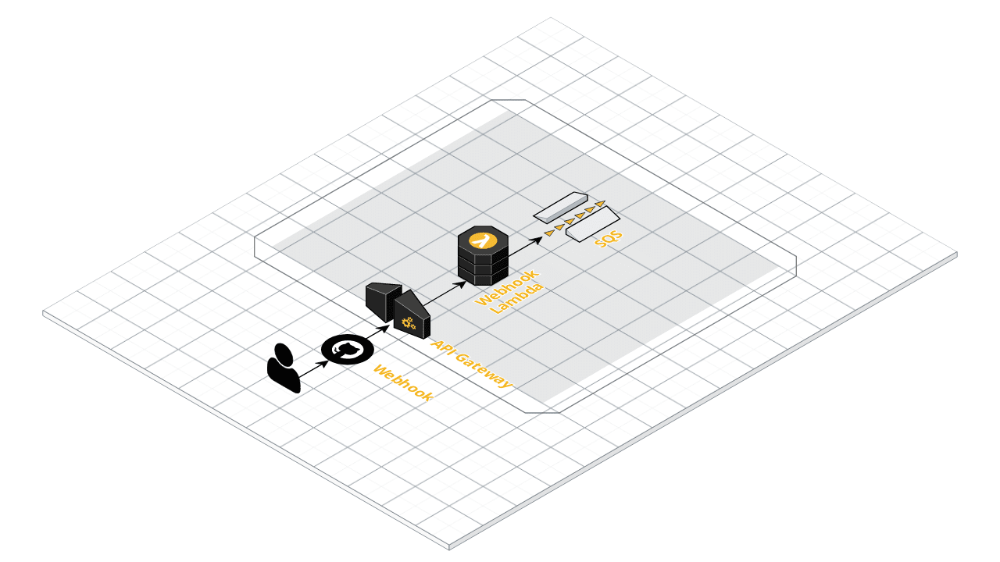

# Welcome to the "Validating A GitHub Webhook Request With AWS Lambda" CDK project

Infrastructure code for validating a GitHub webhook request with AWS Lambda.

Part of [Validating A GitHub Webhook Request With AWS Lambda](https://www.uphill.dev/blog/validating-github-webhook/)
blog post on [uphill.dev](https://www.uphill.dev). 

Will create the following:

This is a project for TypeScript development with CDK.

The `cdk.json` file tells the CDK Toolkit how to execute your app.

## Useful commands

 * `npm run build`   compile typescript to js
 * `npm run watch`   watch for changes and compile
 * `npm run test`    perform the jest unit tests
 * `cdk deploy`      deploy this stack to your default AWS account/region
 * `cdk diff`        compare deployed stack with current state
 * `cdk synth`       emits the synthesized CloudFormation template
